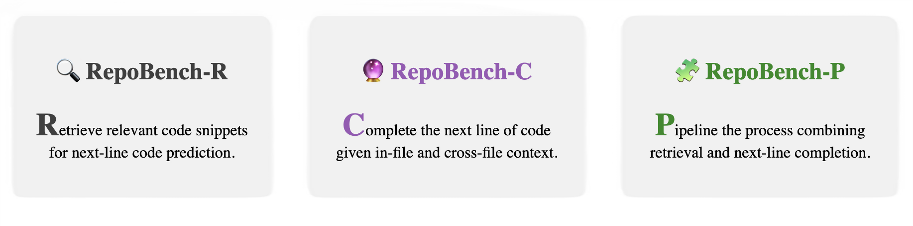

<p align="center">
  <a href="https://github.com/Leolty/repobench#gh-light-mode-only">
    
  </a>
  <a href="https://github.com/Leolty/repobench#gh-dark-mode-only">
    
  </a>

<p align="center"><i>RepoBench: Benchmarking Repository-Level Code Auto-Completion Systems</i></p>

<p align="center">
  <a href="https://arxiv.org/abs/2306.03091">
    
  </a>
  <a href="https://huggingface.co/datasets/tianyang/repobench-r">
    
  </a>
  <a href="https://huggingface.co/datasets/tianyang/repobench-c">
    
  </a>
  <a href="https://huggingface.co/datasets/tianyang/repobench-p">
    
  </a>
</p>

<hr>

<p align="center">
  <strong>🚀 Embark on a Journey with RepoBench Tasks! 🚀</strong>
</p>

<p align="center">
  
</p>

<hr>

## 🛠️ Installation

### Load with 🤗 HuggingFace Datasets

RepoBench is now accessible on 🤗 HuggingFace Datasets. Explore the dataset cards:

- 
- 
- 

### Load by cloning the repository

> **Note**: The repository includes all the compressed data for RepoBench, amounting to ~1.8GB. Please ensure you have sufficient disk space before cloning the repository.

Make sure to use python 3.7 or later:

```bash
conda create -n repobench python=3.7
conda activate repobench
```

Clone the repository and install the requirements:

> **Note**: If you just want to use the dataset, you can skip the installation of the requirements.

```bash
git clone https://github.com/Leolty/repobench.git
cd repobench
pip install -r requirements.txt
```

## ⚙️ Settings

As discussed in the paper, we have three settings for each task:

- `cross_file_first`: Masks the line where a module from a different file is used for the first time.
- `cross_file_random`: Masks a random line where a module from a different file is used (not the first usage).
- `in_file`: Masks a random line that has no cross-file dependency.


## 📥 How to Load Data

You can generally use the `load_data` function found in [`data/utils.py`](data/utils.py) to load the data for each task. The parameters required are:

**Parameters**

- `task` (str): The task name, which can be `retrieval`, `completion`, or `pipeline`.
- `language` (str): The language name, which can be `python` or `java`.
- `settings` (list): The settings for the task. This can be a combination of `cross_file_first`, `cross_file_random`, and `in_file`.

**Returns**

- A list of `dict` objects, where each `dict` is a data sample with a specific setting.

For example, if you want to load the Python data for RepoBench-C with `cross_file_first`, `cross_file_random`, and `in_file` settings, you can do as follows:

```python
from data.utils import load_data

language = "python"
task = "completion"
settings = ["cross_file_first", "cross_file_random", "in_file"]

cross_file_first, cross_file_random, in_file = load_data(task=task, language=language, settings=settings)
```

The data format and specific usage for each task are as follows.

## 🔎 RepoBench-R

RepoBench-R (Retrieval) targets the retrieval component of a repository-level auto-completion system, focusing on extracting the most relevant code snippet from a project repository for next-line code prediction.

### Data Format

The data format for RepoBench-R is as follows. Specifically, this task has two subsets: *easy* and *hard*. Suppose the number of code snippets in the context is $k$, then for the *easy* subset, we have $5 \leq k < 10$, while for the *hard* subset, we have $k \geq 10$.

```JSONC
{
    "easy": [{
            "repo_name": "repository name of the data point",
            "file_path": "path/to/file",
            "context": [
                "snippet 1",
                "snippet 2",
                // ...
                "snippet k"
            ],
            "import_statement": "all import statements in the file",
            "gold_snippet_idex": 2, // the index of the gold snippet in the context list, 0~k-1
            "code": "the code for next-line prediction",
            "next_line": "the next line of the code"
    },
    // ...
    ],
    "hard": [{
            // same as easy
    },
    // ...
    ]
}
```

### Load Data

You can use `load_data` to load the data for RepoBench-R. Note that we do not have `in_file` setting for RepoBench-R.

```python
from data.utils import load_data

language = "python" # or "java"
task = "retrieval"
settings = ["cross_file_first", "cross_file_random"]

cross_file_first, cross_file_random = load_data(task=task, language=language, settings=settings)
```

## 🔮 RepoBench-C

RepoBench-C (Code Completion) focuses on the prediction of the next line of code, given in-file context (including several preceding lines and import statements), and cross-file context. 

### Data Format

The data format for RepoBench-C is as follows. Specifically, this task has three subset: *train*, *dev*, *test*.

```JSONC
{
    "train": [{
        "repo_name": "repository name of the data point",
        "file_path": "path/to/file",
        "context": "commented and concatenated cross-file context",
        "import_statement": "all import statements in the file",
        "code": "the code for next-line prediction",
        "next_line": "the next line of the code"
    },
    // ...
    ],
    "dev": [{
        // same as train
    },
    // ...
    ],
    "test": [{
        // same as train
    },
    // ...
    ]
}
```

### Load Data

You can use `load_data` to load the data for RepoBench-C. Just simply change the `task` parameter to `completion`.

```python
from data.utils import load_data

language = "python" # or "java"
task = "completion"
settings = ["cross_file_first", "cross_file_random", "in_file"]

cross_file_first, cross_file_random, in_file = load_data(task=task, language=language, settings=settings)
```

You can also use `construct_trainable_data` to construct the prompt for inference or training.

```python
from data.utils import construct_trainable_data

cross_file_first = construct_trainable_data(cross_file_first)
cross_file_random = construct_trainable_data(cross_file_random)
in_file = construct_trainable_data(in_file)
```

The format will be as follows:

```JSONC
{
    "data": "prompt (cross-file context + import statements + in-file code)",
    "label": "target (next line of code)"
}
```

## 🧩 RepoBench-P

RepoBench-P (Pipeline) is a pipeline task that combines the retrieval and code completion tasks. Specifically, the retrieval task is used to retrieve the most relevant code snippet first, and then do the code completion task with retrieved code snippet as cross-file context for next-line prediction, which mirrors complex real-world scenarios that a practical auto-completion system would face.

### Data Format

The data format for RepoBench-P is as follows:

```JSONC
[
    {
        "repo_name": "repository name of the data point",
        "file_path": "path/to/current_file",
        "context": [
            {
                "path": "path/to/cross_file_1",
                "identifier": "identifier of the cross-file module",
                "snippet": "the code snippet of the cross-file module",
                "tokenized_snippet": "tokenized code snippet of the cross-file module"
            },
            // ...
            {
                "path": "path/to/cross_file_k",
                "identifier": "identifier of the cross-file module",
                "snippet": "the code snippet of the cross-file module",
                "tokenized_snippet": "tokenized code snippet of the cross-file module"
            },
        ],
        "import_statement": "all import statements in current file",
        "code": "the code for next-line prediction",
        "next_line": "the next line of the code",
        "gold_snippet_index": 2 // NOTE: Only for "cross_file_first" and "cross_file_random" settings, for "in_file" setting, we do not have this field

    },
    // ...
]
```

### Load Data

You can use `load_data` to load the data for RepoBench-P. Just simply change the `task` parameter to `pipeline`.

```python
from data.utils import load_data

language = "python" # or "java"
task = "pipeline"
settings = ["cross_file_first", "cross_file_random", "in_file"]

cross_file_first, cross_file_random, in_file = load_data(task=task, language=language, settings=settings)
```
## 📊 Baseline

See [BASELINE.md](BASELINE.md) for more details.

## 📝 Citation

If you use RepoBench in your research, please consider citing us:

```bibtex
@misc{liu2023repobench,
      title={RepoBench: Benchmarking Repository-Level Code Auto-Completion Systems}, 
      author={Tianyang Liu and Canwen Xu and Julian McAuley},
      year={2023},
      eprint={2306.03091},
      archivePrefix={arXiv},
      primaryClass={cs.CL}
}
```


