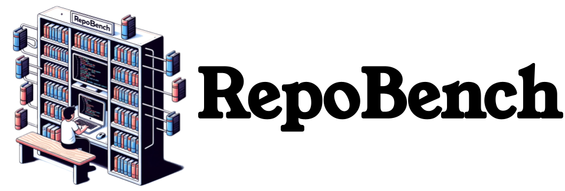
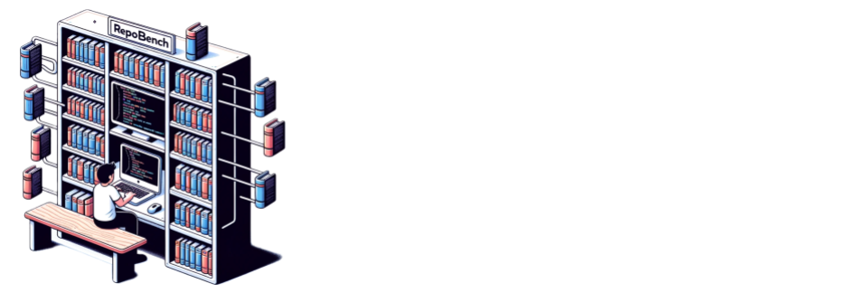

<p align="center">
  <a href="https://github.com/Leolty/repobench#gh-light-mode-only">
    
  </a>
  <a href="https://github.com/Leolty/repobench#gh-dark-mode-only">
    
  </a>

<p align="center">
  <a href="https://arxiv.org/abs/2306.03091">
    RepoBench: Benchmarking Repository-Level Code Auto-Completion Systems
  </a>
  <br></br>
  <a>
    <b>ICLR 2024</b>
  </a>
</p>

<hr>

This directory hosts the datasets for subsequet versions of RepoBench. We are committed to updating RepoBench regularly, with updates scheduled **every 3 months**.

## 🌇 Overview

- Our primary focus is on **next-line prediction** tasks to aid in code auto-completion. If your research requires retrieval data, please don't hesitate to reach out to us for collaboration.
- Our datasets will be hosted on 🤗 HuggingFace, making them easily accessible for everyone.
- Each data point within our datasets is categorized based on the prompt length (number of tokens), which is determined by OpenAI's GPT-4 tokenizer using [tiktoken](https://github.com/openai/tiktoken). Here's a detailed table illustrating the levels we've defined:

  | Level | Prompt Length (Number of Tokens) |
  |-------|------------------------|
  | 2k    | 640 - 1,600            |
  | 4k    | 1,600 - 3,600          |
  | 8k    | 3,600 - 7,200          |
  | 12k   | 7,200 - 10,800         |
  | 16k   | 10,800 - 14,400        |
  | 24k   | 14,400 - 21,600        |
  | 32k   | 21,600 - 28,800        |
  | 64k   | 28,800 - 57,600        |
  | 128k  | 57,600 - 100,000       |

- We hereby provide the official implementation for constructing prompts [here](https://github.com/Leolty/repobench/blob/53c1c55ad9e6d97d2b60dd2c9548ed1cd463b6a5/data/utils.py#L3). Please note that the methods provided are not necessarily the optimal way of construction. Reordering, retrieval argumentation, or employing different cropping/construction techniques could potentially lead to varying degrees of improvement. Ensure that the evaluations are conducted fairly.

## 📚 Versions

### RepoBench v1.1

RepoBench v1.1 includes data collected from GitHub between **October 6, 2023**, and **December 31, 2023**. To mitigate the data leakage and memorization issues, we conducted a deduplication process on the Stack v2 (coming soon) based on the file content.

You can access RepoBench v1.1 at the following links:
- For Python: [🤗 Repobench Python V1.1](https://huggingface.co/datasets/tianyang/repobench_python_v1.1)
- For Java: [🤗 Repobench Java V1.1](https://huggingface.co/datasets/tianyang/repobench_java_v1.1)

Or, you can load the data directly from the HuggingFace Hub using the following code:

```python
from datasets import load_dataset

# Load the Python dataset
python_dataset = load_dataset("tianyang/repobench_python_v1.1")

# Load the Java dataset
java_dataset = load_dataset("tianyang/repobench_java_v1.1")
```

### RepoBench v1.2

*Cooming soon...*

## 📝 Citation

If you use RepoBench in your research, please cite the following paper:

```bibtex
@misc{liu2023repobench,
      title={RepoBench: Benchmarking Repository-Level Code Auto-Completion Systems}, 
      author={Tianyang Liu and Canwen Xu and Julian McAuley},
      year={2024},
      url={https://arxiv.org/abs/2306.03091},
      booktitle={International Conference on Learning Representations}
}
```
